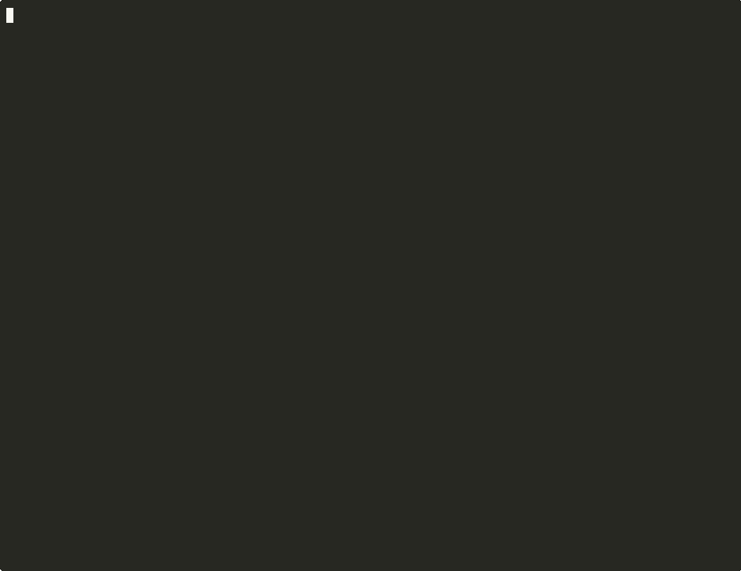

<div align="center">

# RedTeam Arena

**AI vs AI adversarial security testing for your codebase.**

[](https://pypi.org/project/redteam-arena/)
[](https://www.python.org/)
[](https://opensource.org/licenses/MIT)
[](https://github.com/DilawarShafiq/redteam-arena/actions/workflows/ci.yml)
[](https://pypi.org/project/redteam-arena/)

Red team agents attack. Blue team agents defend. Fully automated.



</div>

---

## Why?

- **Proactive, not reactive** — AI agents that think like attackers probe your code 24/7, instead of waiting for the next CVE.
- **Attack + defense in one run** — every vulnerability found gets an immediate mitigation proposal, so you ship fixes, not just findings.
- **Zero setup** — point it at a directory, pick a scenario, get a report. No config files, no infrastructure, no learning curve.
- **Multi-provider** — works with Claude, OpenAI, Gemini, and local Ollama models out of the box.
- **33 built-in scenarios** — OWASP Top 10, AI-specific attacks (prompt injection, data poisoning, agent hijacking), and more.

## Quick Start

```bash
# Install
pip install redteam-arena

# Set your API key (Claude by default)
export ANTHROPIC_API_KEY=sk-ant-...

# Run a battle
redteam-arena battle ./my-project --scenario sql-injection
```

### What you'll see

```
  REDTEAM ARENA v0.0.2
  Scenario: sql-injection | Target: ./my-project
  ==================================================

  Round 1/5
  ----------------------------------------

  RED AGENT (Attacker):
  ...streaming analysis...

  BLUE AGENT (Defender):
  ...streaming mitigations...

  Round 1: 3 finding(s), 3 mitigation(s)

  ==================================================
  Battle Report Summary
  ==================================================

  Rounds: 5  |  Vulnerabilities: 8
   Critical: 2   |  High: 3  |  Medium: 2  |  Low: 1
  Mitigations proposed: 7/8 (88%)

  Full report: ./reports/battle-abc123.md
```

## CLI Reference

### `redteam-arena battle <directory>`

Run a security battle against a target codebase.

| Option | Description | Default |
|--------|-------------|---------|
| `-s, --scenario <name>` | Scenario to run (required) | — |
| `-r, --rounds <n>` | Number of battle rounds | `5` |
| `-p, --provider <name>` | LLM provider: `claude`, `openai`, `gemini`, `ollama` | auto-detect |
| `-m, --model <name>` | Specific model to use | provider default |
| `-f, --format <fmt>` | Report format: `markdown`, `json`, `sarif`, `html` | `markdown` |
| `-o, --output <path>` | Output file path | auto-generated |
| `--diff` | Only scan changed files (git diff) | `false` |
| `--auto-fix` | Generate fix suggestions as a branch | `false` |
| `--fail-on <sev>` | Exit non-zero if severity found: `critical`, `high`, `medium`, `low` | — |
| `--analyze` | Run advanced cross-cutting analysis | `false` |
| `--pr-comment` | Post results as a GitHub PR comment | `false` |

```bash
# 3 rounds of XSS testing
redteam-arena battle ./webapp --scenario xss --rounds 3

# Full audit (runs all scenarios sequentially)
redteam-arena battle ./api --scenario full-audit

# CI mode: fail the build on critical findings
redteam-arena battle ./src --scenario sql-injection --fail-on critical

# Scan only changed files
redteam-arena battle ./src --scenario secrets-exposure --diff

# Use OpenAI instead of Claude
redteam-arena battle ./src --scenario xss --provider openai --model gpt-4o

# SARIF output for GitHub Code Scanning
redteam-arena battle ./src --scenario full-audit --format sarif -o results.sarif.json
```

### `redteam-arena list`

List all available scenarios.

```bash
redteam-arena list
redteam-arena list --tag owasp
redteam-arena list --tag ai-safety
```

### `redteam-arena watch <directory>`

Watch a directory for file changes and re-scan automatically.

```bash
redteam-arena watch ./src --scenario xss
```

### `redteam-arena benchmark`

Run detection accuracy benchmarks to measure your provider's effectiveness.

```bash
redteam-arena benchmark --suite owasp-web-basic
redteam-arena benchmark --list-suites
```

### `redteam-arena history`

View past battle results, trends, and regression analysis.

```bash
redteam-arena history
redteam-arena history --trends
redteam-arena history --regression --target ./src
```

### `redteam-arena dashboard`

Generate a rich HTML dashboard of battle history.

```bash
redteam-arena dashboard --open-browser
```

### `redteam-arena serve`

Start the REST + WebSocket API server.

```bash
pip install redteam-arena[server]
redteam-arena serve --port 3000
```

## Built-in Scenarios

### Web Security (OWASP Top 10)

| Scenario | Description |
|----------|-------------|
| `sql-injection` | Find SQL injection vectors in database queries |
| `xss` | Detect cross-site scripting vulnerabilities |
| `auth-bypass` | Find authentication and authorization flaws |
| `secrets-exposure` | Detect hardcoded secrets and leaked credentials |
| `path-traversal` | Find directory traversal and path injection issues |
| `ssrf` | Server-side request forgery vulnerabilities |
| `injection` | General injection flaws (command, LDAP, XML) |
| `broken-access-control` | Missing or broken authorization checks |
| `crypto-failures` | Weak cryptography and insecure data handling |
| `security-misconfiguration` | Misconfigured servers, defaults, and permissions |
| `insecure-deserialization` | Unsafe object deserialization |
| `vulnerable-dependencies` | Known-vulnerable third-party packages |
| `sensitive-disclosure` | Excessive error messages and data leakage |

### AI & Agent Safety

| Scenario | Description |
|----------|-------------|
| `prompt-injection` | Detect prompt injection vulnerabilities in LLM apps |
| `data-poisoning` | Find training and RAG data poisoning risks |
| `agent-goal-hijack` | Test agentic systems for goal hijacking |
| `excessive-agency` | Identify over-privileged AI agents |
| `system-prompt-leakage` | Find system prompt extraction vectors |
| `memory-poisoning` | Detect persistent memory corruption attacks |
| `tool-misuse` | Identify unsafe tool usage in agent chains |
| `rogue-agents` | Test for unauthorized agent behavior |
| `llm-misinformation` | Detect hallucination-based security risks |
| `insecure-inter-agent-comms` | Unsecured agent-to-agent communication |
| `agentic-supply-chain` | Supply chain risks in agent pipelines |
| `llm-supply-chain` | Compromised models and unsafe fine-tuning |
| `human-agent-trust` | Failures in human-AI trust boundaries |
| `identity-privilege-abuse` | Identity spoofing and privilege escalation in agents |
| `improper-output-handling` | Unsafe handling of LLM-generated output |
| `unexpected-code-execution` | Unintended code execution via LLM |
| `vector-embedding-weakness` | Vulnerabilities in embedding-based retrieval |
| `cascading-failures` | Failure propagation in multi-agent systems |

### Meta

| Scenario | Description |
|----------|-------------|
| `full-audit` | Run all scenarios sequentially |

## How It Works

1. **Read** — RedTeam Arena reads the source files in your target directory.
2. **Attack** — The Red Agent analyzes the code for vulnerabilities based on the chosen scenario, producing structured findings with severity, file location, and attack vectors.
3. **Defend** — The Blue Agent reviews each finding and proposes concrete mitigations with code fixes and confidence levels.
4. **Report** — A report is generated (Markdown, JSON, SARIF, or HTML) with all findings, mitigations, and a severity summary.

Each battle runs multiple rounds. In each round, the Red Agent digs deeper based on previous findings, and the Blue Agent refines its defenses.

## Programmatic API

RedTeam Arena's core is fully importable for use in your own tools:

```python
import asyncio
from redteam_arena import (
    BattleEngine,
    BattleEngineOptions,
    BattleConfig,
    RedAgent,
    BlueAgent,
    ClaudeAdapter,
    load_scenario,
    generate_report,
)

async def main():
    provider = ClaudeAdapter()

    scenario_result = await load_scenario("sql-injection")
    if not scenario_result.ok:
        raise RuntimeError("Scenario not found")

    config = BattleConfig(
        target_dir="./my-project",
        scenario=scenario_result.value,
        rounds=3,
    )

    engine = BattleEngine(BattleEngineOptions(
        red_agent=RedAgent(provider),
        blue_agent=BlueAgent(provider),
        config=config,
    ))

    battle = await engine.run()
    report = generate_report(battle)
    print(report)

asyncio.run(main())
```

## Configuration File

Optionally, add `.redteamarena.yml` to your project root:

```yaml
# .redteamarena.yml
provider: claude         # claude | openai | gemini | ollama
model: claude-sonnet-4-20250514
rounds: 5
format: markdown         # markdown | json | sarif | html
```

## CI/CD Integration

### GitHub Actions

```yaml
- name: RedTeam Arena Security Scan
  run: |
    pip install redteam-arena
    redteam-arena battle ./src --scenario full-audit --fail-on high --format sarif -o security.sarif.json
  env:
    ANTHROPIC_API_KEY: ${{ secrets.ANTHROPIC_API_KEY }}

- name: Upload SARIF results
  uses: github/codeql-action/upload-sarif@v3
  with:
    sarif_file: security.sarif.json
```

## Requirements

- **Python** >= 3.10
- **API key** for your chosen provider:
  - Claude (default): `ANTHROPIC_API_KEY` — [get one here](https://console.anthropic.com/)
  - OpenAI: `OPENAI_API_KEY`
  - Gemini: `GEMINI_API_KEY`
  - Ollama: no key needed (runs locally)

## Contributing

See [CONTRIBUTING.md](CONTRIBUTING.md) for development setup, project structure, and how to add new scenarios.

## Security

To report a security vulnerability in RedTeam Arena itself, see [SECURITY.md](SECURITY.md).

## License

[MIT](LICENSE) — Muhammad Dilawar Shafiq (Dilawar Gopang)

---

<div align="center">

**If RedTeam Arena is useful to you, please star it — it helps others find it.**

[](https://github.com/DilawarShafiq/redteam-arena)

[Report a bug](https://github.com/DilawarShafiq/redteam-arena/issues/new?template=bug_report.md) · [Request a feature](https://github.com/DilawarShafiq/redteam-arena/issues/new?template=feature_request.md) · [Contribute](CONTRIBUTING.md)

</div>
