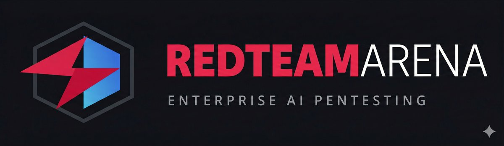
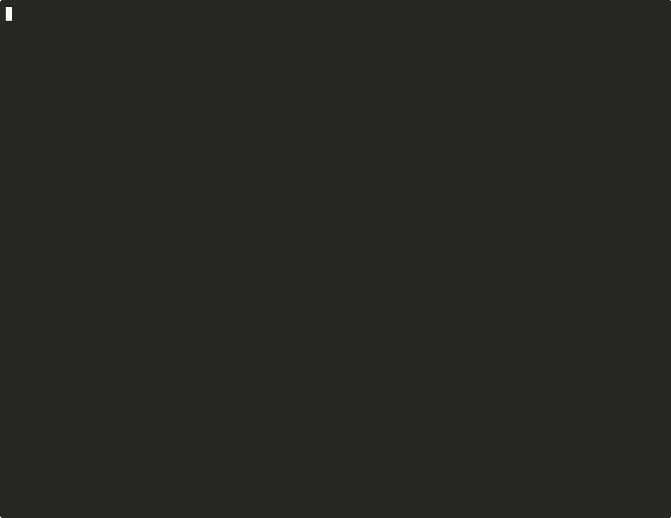

<div align="center">



**Adversarial testing for AI agent systems — complete OWASP Agentic Top 10 (2026) coverage.**

[](https://pypi.org/project/redteam-arena/)
[](https://www.python.org/)
[](https://opensource.org/licenses/MIT)
[](https://github.com/DilawarShafiq/redteam-arena/actions/workflows/ci.yml)
[](https://pypi.org/project/redteam-arena/)

Red team agents attack. Blue team agents defend. Fully automated.



</div>

---

## Why?

- **Complete OWASP Agentic Top 10 (2026) coverage** — a scenario for every risk from ASI01 Agent Goal Hijack through ASI10 Rogue Agents. If you're building with agents, tools, and memory, this is the checklist you're being measured against.
- **Findings are checked against your source** — every reported location is validated: the file must exist in what was scanned, the line must be in range, and any quoted snippet must actually appear. Unconfirmed findings are labelled, not quietly presented as fact.
- **Every report states its scope** — you're told how much of your codebase was read, and warned when coverage was partial.
- **Attack + defense in one run** — each finding gets a proposed mitigation, so you get direction, not just a list.
- **Any LLM** — Claude, OpenAI, Gemini, or local Ollama. No model is hardcoded; each provider uses its own default, and `--model` overrides it.
- **45 built-in scenarios** — the Agentic Top 10, OWASP Web, LLM-specific attacks, and compliance-framework gap analysis.

### What this is, and what it isn't

RedTeam Arena reads your source and asks an LLM to reason about it adversarially.
That makes it a **fast way to generate leads for a human reviewer**. It is not a
replacement for one.

It does **not** execute code, run exploits, or produce proof-of-concepts, so it
cannot confirm that anything it reports is genuinely exploitable. Independent
benchmarks put false-discovery rates for LLM-based code analysis high enough that
**every finding needs human confirmation before you act on it.** The validation
pass above exists to make that triage cheaper, not to remove it.

For compliance work specifically: the gap-analysis report is **preparatory input
for an auditor, never an audit**. SOC 2 is an attestation signed by a licensed CPA
firm; ISO 27001 is issued by an accredited certification body that is barred from
having consulted on your ISMS; HITRUST certificates are issued by HITRUST itself
after its own QA review. No tool — this one included — can produce, replace, or
shortcut any of that.

## Quick Start

```bash
# Install
pip install redteam-arena

# Set a key for whichever provider you use
export ANTHROPIC_API_KEY=sk-ant-...    # or OPENAI_API_KEY, or GOOGLE_API_KEY
# (Ollama needs no key — it runs locally)

# Test an agent system against OWASP ASI01
redteam-arena battle ./my-agent --scenario agent-goal-hijack

# Or point it at ordinary application code
redteam-arena battle ./my-project --scenario sql-injection
```

### What you'll see

```
  REDTEAM ARENA v0.0.4
  Scenario: sql-injection | Target: ./my-project
  ==================================================

  Round 1/5
  ----------------------------------------

  RED AGENT (Attacker):
  ...streaming analysis...

  BLUE AGENT (Defender):
  ...streaming mitigations...

  Round 1: 3 finding(s), 3 mitigation(s)

  ==================================================
  Battle Report Summary
  ==================================================

  Rounds: 5  |  Vulnerabilities: 8
   Critical: 2   |  High: 3  |  Medium: 2  |  Low: 1
  Mitigations proposed: 7/8 (88%)

  Full report: ./reports/battle-abc123.md
```

## CLI Reference

### `redteam-arena battle <directory>`

Run a security battle against a target codebase.

| Option | Description | Default |
|--------|-------------|---------|
| `-s, --scenario <name>` | Scenario to run (required) | — |
| `-r, --rounds <n>` | Number of battle rounds | `5` |
| `-p, --provider <name>` | LLM provider: `claude`, `openai`, `gemini`, `ollama` | auto-detect |
| `-m, --model <name>` | Specific model to use | provider default |
| `-f, --format <fmt>` | Report format: `markdown`, `json`, `sarif`, `html`, `compliance` | `markdown` |
| `-o, --output <path>` | Output file path | auto-generated |
| `--agent-mode <mode>` | Agent focus: `attacker` (default) or `auditor` | `attacker` |
| `--mock-llm` | Use a mock LLM for testing/demo (fast & free) | `false` |
| `--diff` | Only scan changed files (git diff) | `false` |
| `--auto-fix` | Write fix proposals as markdown files (does **not** edit source) | `false` |
| `--auto-fix-branch` | Also commit each proposal to its own git branch | `false` |
| `--fail-on <sev>` | Exit non-zero if severity found: `critical`, `high`, `medium`, `low` | — |
| `--analyze` | Run advanced cross-cutting analysis | `false` |
| `--pr-comment` | Post results as a GitHub PR comment | `false` |

```bash
# 3 rounds of XSS testing
redteam-arena battle ./webapp --scenario xss --rounds 3

# Test an agent system against a specific OWASP ASI risk
redteam-arena battle ./my-agent --scenario memory-poisoning --rounds 3

# Bundled run (sql-injection, xss, auth-bypass, secrets-exposure)
redteam-arena battle ./api --scenario full-audit

# CI mode: fail the build on critical findings
redteam-arena battle ./src --scenario sql-injection --fail-on critical

# Scan only changed files
redteam-arena battle ./src --scenario secrets-exposure --diff

# Any provider. Omit --model to use that provider's default.
redteam-arena battle ./src --scenario xss --provider openai --model gpt-4o
redteam-arena battle ./src --scenario xss --provider gemini
redteam-arena battle ./src --scenario xss --provider ollama    # fully local

# HIPAA/HITECH control gap analysis (preparatory input, not an audit)
redteam-arena battle ./medical-app --scenario hipaa-hitech-readiness --agent-mode auditor --format compliance

# SARIF output
redteam-arena battle ./src --scenario full-audit --format sarif -o results.sarif.json
```

### `redteam-arena list`

List all available scenarios.

```bash
redteam-arena list
redteam-arena list --tag owasp
redteam-arena list --tag ai-safety
```

### `redteam-arena watch <directory>`

Watch a directory for file changes and re-scan automatically.

```bash
redteam-arena watch ./src --scenario xss
```

### `redteam-arena benchmark`

Run detection accuracy benchmarks to measure your provider's effectiveness.

```bash
redteam-arena benchmark --suite owasp-web-basic
redteam-arena benchmark --list-suites
```

### `redteam-arena history`

View past battle results, trends, and regression analysis.

```bash
redteam-arena history
redteam-arena history --trends
redteam-arena history --regression --target ./src
```

### `redteam-arena dashboard`

Generate a rich HTML dashboard of battle history.

```bash
redteam-arena dashboard --open-browser
```

### `redteam-arena serve`

Start the REST + WebSocket API server.

```bash
pip install redteam-arena[server]
redteam-arena serve --port 3000
```

## Built-in Scenarios

### Web Security (OWASP Top 10)

| Scenario | Description |
|----------|-------------|
| `sql-injection` | Find SQL injection vectors in database queries |
| `xss` | Detect cross-site scripting vulnerabilities |
| `auth-bypass` | Find authentication and authorization flaws |
| `secrets-exposure` | Detect hardcoded secrets and leaked credentials |
| `path-traversal` | Find directory traversal and path injection issues |
| `ssrf` | Server-side request forgery vulnerabilities |
| `injection` | General injection flaws (command, LDAP, XML) |
| `broken-access-control` | Missing or broken authorization checks |
| `crypto-failures` | Weak cryptography and insecure data handling |
| `security-misconfiguration` | Misconfigured servers, defaults, and permissions |
| `insecure-deserialization` | Unsafe object deserialization |
| `vulnerable-dependencies` | Known-vulnerable third-party packages |
| `sensitive-disclosure` | Excessive error messages and data leakage |

### OWASP Agentic Top 10 (2026) — all 10 covered

The [OWASP Top 10 for Agentic Applications](https://genai.owasp.org/resource/owasp-top-10-for-agentic-applications-for-2026/),
published December 2025, is the reference list for securing systems built from
agents, tools, and memory. There is a scenario for each risk:

| ID | Scenario | Risk |
|----|----------|------|
| ASI01 | `agent-goal-hijack` | Agent Goal Hijack — objectives redirected via injected content |
| ASI02 | `tool-misuse` | Tool Misuse — unsafe tool invocation in agent chains |
| ASI03 | `identity-privilege-abuse` | Agent Identity & Privilege Abuse |
| ASI04 | `agentic-supply-chain` | Agentic Supply Chain Compromise — MCP servers, plugins, registries |
| ASI05 | `unexpected-code-execution` | Unexpected Code Execution |
| ASI06 | `memory-poisoning` | Memory & Context Poisoning |
| ASI07 | `insecure-inter-agent-comms` | Insecure Inter-Agent Communication |
| ASI08 | `cascading-failures` | Cascading Agent Failures |
| ASI09 | `human-agent-trust` | Human-Agent Trust Exploitation |
| ASI10 | `rogue-agents` | Rogue Agents |

`redteam-arena list` prints this coverage so you can verify it against the
standard yourself.

### Other AI & LLM Security

| Scenario | Description |
|----------|-------------|
| `prompt-injection` | Detect prompt injection vulnerabilities in LLM apps |
| `data-poisoning` | Find training and RAG data poisoning risks |
| `excessive-agency` | Identify over-privileged AI agents |
| `system-prompt-leakage` | Find system prompt extraction vectors |
| `llm-misinformation` | Detect hallucination-based security risks |
| `llm-supply-chain` | Compromised models and unsafe fine-tuning |
| `improper-output-handling` | Unsafe handling of LLM-generated output |
| `vector-embedding-weakness` | Vulnerabilities in embedding-based retrieval |
| `unbounded-consumption` | Resource exhaustion and cost-amplification risks |

### Threat Simulation & Infrastructure

| Scenario | Description |
|----------|-------------|
| `apt-advanced-persistent-threat` | Reasons about chained attack paths (LotL, MFA bypass, lateral movement) |
| `infrastructure-as-code` | Reviews Terraform, Kubernetes, and Docker files for misconfigurations |

### Compliance Gap Analysis

> These scenarios produce **preparatory input for a human reviewer or auditor —
> not an audit, and not certification.** Output is unverified LLM analysis of
> source code. Certification against any of these frameworks requires an
> engagement with an accredited third party. See
> [What this is, and what it isn't](#what-this-is-and-what-it-isnt).

| Scenario | Framework |
|----------|-----------|
| `iso-42001-ai-compliance` | ISO/IEC 42001 AI Management System |
| `soc2-security-privacy` | SOC 2 Trust Services Criteria |
| `fedramp-readiness` | FedRAMP / NIST 800-53 technical controls |
| `hipaa-hitech-readiness` | HIPAA/HITECH (ePHI security and audit logs) |
| `hitrust-csf-compliance` | HITRUST CSF (DLP, device trust) |
| `epcs-dea-compliance` | DEA EPCS (electronic prescriptions) |
| `pci-dss-readiness` | PCI DSS v4.0 |
| `iso-27001-infosec` | ISO/IEC 27001 Information Security Management |
| `cmmc-dod-readiness` | CMMC Level 2 (DoD) |
| `gdpr-ccpa-privacy` | GDPR / CCPA / ISO 27701 |

## How It Works

1. **Read** — RedTeam Arena reads the source files in your target directory, up to a fixed context budget. What it read, and anything it skipped, is recorded.
2. **Attack** — The Red Agent analyzes that source for vulnerabilities based on the chosen scenario, producing structured findings with severity, file location, and attack vectors.
3. **Validate** — Each finding's reported location is checked against the source actually scanned: the file must exist, the line must be in range, and any quoted snippet must appear in it. Findings that fail are marked, not dropped — a mislocated finding may still describe something real.
4. **Defend** — The Blue Agent reviews each finding and proposes mitigations with confidence levels.
5. **Report** — A report is generated (Markdown, JSON, SARIF, or HTML) with findings, mitigations, a severity summary, validation results, and an explicit statement of how much of your codebase was examined.

Each battle runs multiple rounds. In each round, the Red Agent digs deeper based on previous findings, and the Blue Agent refines its defenses.

**Step 3 is the one that matters most.** LLMs reporting vulnerabilities in source
code produce a high rate of confident, well-written findings that turn out to be
wrong. Validation cannot tell you whether a described vulnerability is real — only
whether the location it points at exists. Treat it as triage ordering, not a verdict.

## Programmatic API

RedTeam Arena's core is fully importable for use in your own tools:

```python
import asyncio
from redteam_arena import (
    BattleEngine,
    BattleEngineOptions,
    BattleConfig,
    RedAgent,
    BlueAgent,
    ClaudeAdapter,
    load_scenario,
    generate_report,
)

async def main():
    provider = ClaudeAdapter()

    scenario_result = await load_scenario("sql-injection")
    if not scenario_result.ok:
        raise RuntimeError("Scenario not found")

    config = BattleConfig(
        target_dir="./my-project",
        scenario=scenario_result.value,
        rounds=3,
    )

    engine = BattleEngine(BattleEngineOptions(
        red_agent=RedAgent(provider),
        blue_agent=BlueAgent(provider),
        config=config,
    ))

    battle = await engine.run()
    report = generate_report(battle)
    print(report)

asyncio.run(main())
```

## Configuration File

Optionally, add `.redteamarena.yml` to your project root:

```yaml
# .redteamarena.yml
provider: claude         # claude | openai | gemini | ollama
model: claude-sonnet-4-20250514
rounds: 5
format: markdown         # markdown | json | sarif | html
```

## CI/CD Integration

### GitHub Actions

```yaml
- name: RedTeam Arena Security Scan
  run: |
    pip install redteam-arena
    redteam-arena battle ./src --scenario full-audit --fail-on high --format sarif -o security.sarif.json
  env:
    ANTHROPIC_API_KEY: ${{ secrets.ANTHROPIC_API_KEY }}

- name: Upload SARIF results
  uses: github/codeql-action/upload-sarif@v3
  with:
    sarif_file: security.sarif.json
```

> **Note on stability:** Rule IDs and result fingerprints are derived only from
> the scenario and the reported location, not the model's wording, so alerts
> persist across runs and dismissals stick. Paths are resolved relative to the
> enclosing git repository root. Line numbers are still model-reported and may be
> approximate, so an alert can land a few lines off — validate before acting.

## Requirements

- **Python** >= 3.10
- **API key** for your chosen provider:
  - Claude (default): `ANTHROPIC_API_KEY` — [get one here](https://console.anthropic.com/)
  - OpenAI: `OPENAI_API_KEY`
  - Gemini: `GEMINI_API_KEY`
  - Ollama: no key needed (runs locally)

## Contributing

See [CONTRIBUTING.md](CONTRIBUTING.md) for development setup, project structure, and how to add new scenarios.

## Security

To report a security vulnerability in RedTeam Arena itself, see [SECURITY.md](SECURITY.md).

## License

[MIT](LICENSE) — Muhammad Dilawar Shafiq (Dilawar Gopang)

---

<div align="center">

**If RedTeam Arena is useful to you, please star it — it helps others find it.**

[](https://github.com/DilawarShafiq/redteam-arena)

[Report a bug](https://github.com/DilawarShafiq/redteam-arena/issues/new?template=bug_report.md) · [Request a feature](https://github.com/DilawarShafiq/redteam-arena/issues/new?template=feature_request.md) · [Contribute](CONTRIBUTING.md)

</div>
